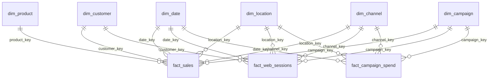

# Power BI Model and Report Specification

## Connection

- Source: local PostgreSQL database `omnichannel_retail`.
- Mode: Import.
- Load the six dimensions, three fact tables, and five analytical views from the `analytics` schema.
- Mark `dim_date[full_date]` as the date table.
- Hide surrogate keys and technical provenance IDs from report view; retain `is_simulated`, `source_system`, and `simulation_version` for audit filters.

## Relationships

All relationships are one-to-many, dimension to fact, with single-direction filtering.

Customer and campaign relationships allow blank foreign keys. Do not create bidirectional relationships.

## Page 1 - Executive performance

- Cards: Net Revenue, Revenue MoM %, Gross Margin %, Contribution Margin, Average Order Value, Monthly Retention Rate.
- Line chart: monthly Net Revenue and Contribution Margin.
- Stacked column: Net Revenue by sales channel.
- Matrix: current-month exception list for revenue decline, margin pressure, low retention, and negative campaign ROI.
- Slicers: date, sales channel, location type, product category, provenance.

## Page 2 - Customer and retention

- Cards: Active Customers, Repeat Customer Rate, Monthly Retention Rate, Observed Historical CLV.
- Cohort-style matrix: monthly retention from `v_customer_retention`.
- Bar chart: customer count and monetary value by RFM segment from `v_customer_rfm`.
- Scatter: frequency versus monetary value, sized by observed historical CLV.
- Detail table: At Risk and Lost customers, recency, frequency, value, and recommended treatment.

## Page 3 - Product and store operations

- Cards: store Net Revenue, Gross Margin %, Return Line Rate, Store Variance %.
- Matrix: category by store with conditional formatting for margin and variance.
- Scatter: product revenue versus gross margin, sized by quantity.
- Bar chart: store variance versus peer-format average.
- Map: simulated physical stores; title and tooltip must identify them as simulated.

## Page 4 - Marketing and channel efficiency

- Cards: Campaign Spend, Attributed Revenue, Campaign ROAS, Campaign ROI, Customer Acquisition Cost, Session Conversion Rate.
- Funnel: Sessions, product views, add-to-cart, checkout, conversions.
- Scatter: campaign spend versus attributed gross margin, colored by ROI sign.
- Bar chart: ROAS and ROI by campaign.
- Trend: spend and conversions by month.

## Design and accessibility

- Canvas: 16:9; minimum 12 pt labels and 20 pt page titles.
- Use dark navy `#16324F`, teal `#2A9D8F`, amber `#E9C46A`, red `#C94C4C`, and neutral greys.
- Do not rely on color alone; pair status color with text or icons.
- Use GBP formats, one decimal percentage formats, and explicit zero/blank states.
- Add this footer to every page: `Business-case data: UCI Online Retail public transactions plus deterministic simulated omnichannel extensions.`
- Marketing-channel slicers apply to page 4; sales-channel slicers apply to pages 1 and 3. Do not sync incompatible role-playing channel filters.

## Acceptance

- Reconcile overall totals and at least three filter scenarios with PostgreSQL.
- Currency variance tolerance: £0.01. Rate tolerance: 0.1 percentage points.
- Verify blank customer and campaign keys do not disappear from revenue totals.
- Export four pages to PDF and inspect every page at full size before approval.
